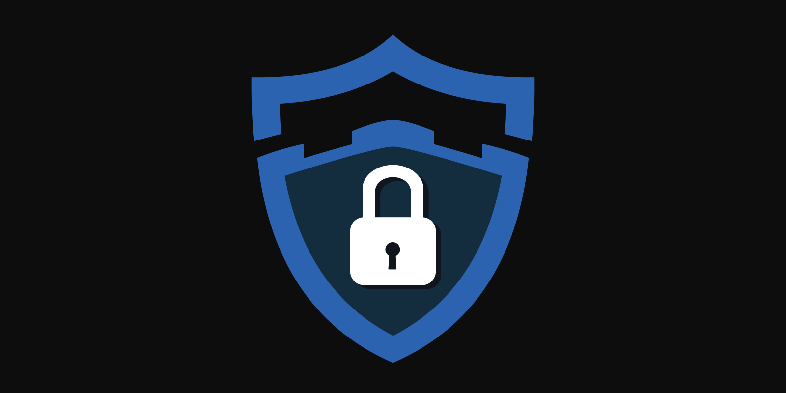

# Getting Started

# Introduction

Captcha.bot is the **largest** account verification and anti-phishing Discord bot. Captcha.bot secures your server from raids and account hijacking links 24/7 for **FREE**. 

# Getting Started

To setup the bot you need the `Administrator` permission or must be the server owner. If you don't have the `Administrator` permission, please contact the owner of the server and ask for this permission in order to set up the bot. 

# Inviting the bot

You can invite the bot by clicking [here](https://captcha.bot/invite). Please give it all permissions it requests, otherwise it may not function properly. Make sure to move the bot's role above the roles you want it to assign. 

# Setup
Now that you've invited the bot you can begin setting it up. View our setup process [here](/introduction/setup-process.md).

