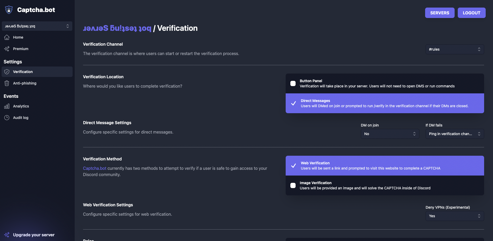
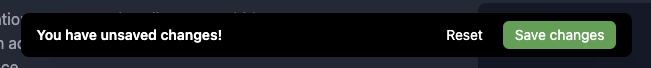

# Basic Setup

Now that you have invited the bot in your server, it is now time to set it up. Captcha.bot is configured on our dashboard which can be found [here](https://captcha.bot/dashboard).

You are **required** to setup a verification channel, choose between two locations, and add a verified role for the bot to work. 

Changes are NOT automatically saved so make sure once you are done you save the changes :)

# Need more help?

Continue reading the docs or join our [support server](https://discord.gg/captcha).