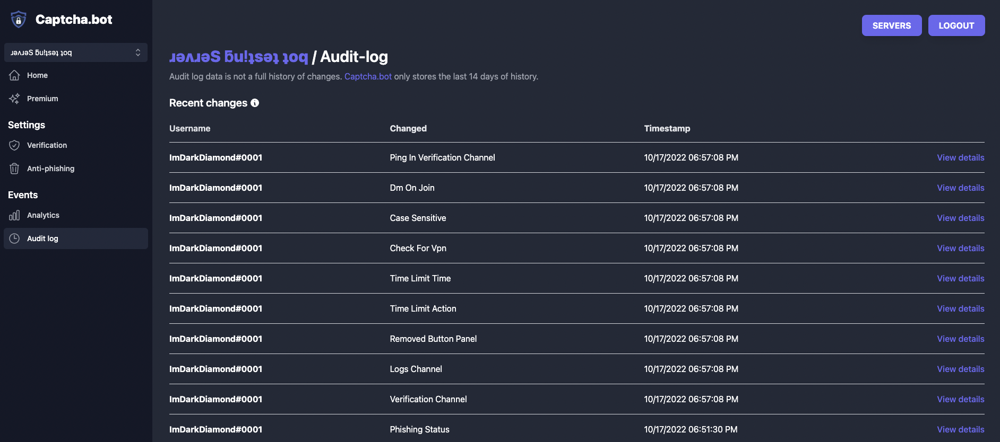
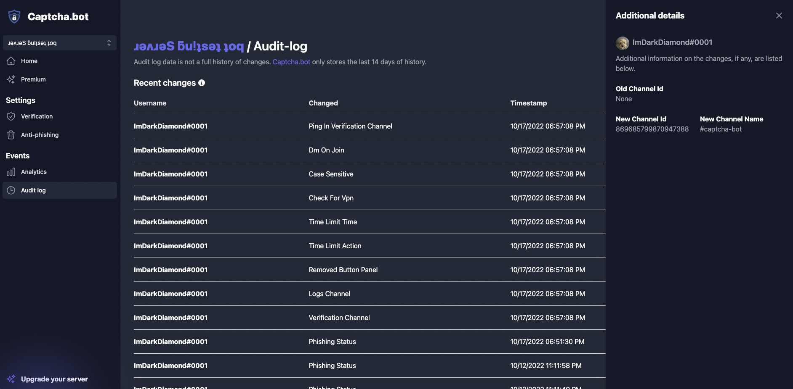

# Audit Log

Captcha.bot provides an audit log so you can know who has been making changes to the bots configuration. 

## Who can view a server's audit log?

Currently only server administrators and the server owner can view the audit log. 

## Viewing more details

Some changes which the bot tracks will contain additional data for you to view. You may be presented the value before it was changed. 

To view any additional details on an audit log event you can click the row or the "View details" button. This will bring up a menu where you can view more specific data. To exit just click the X on the top right. 

## Exporting

You can export your server's audit log ever hour. Please be patient as it can take a few seconds or minutes to gather all your data and convert it to a CSV for download. 

## Opting out of audit log

You cannot opt out of the audit log. All changes you make will be stored for up to 14 days using industry standard encryption & security practicies.