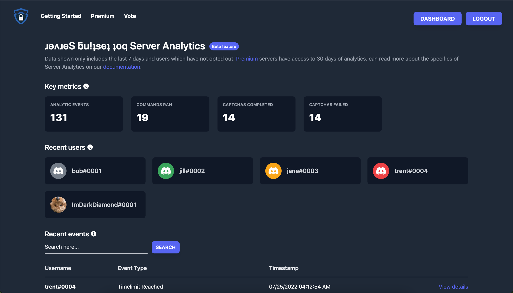
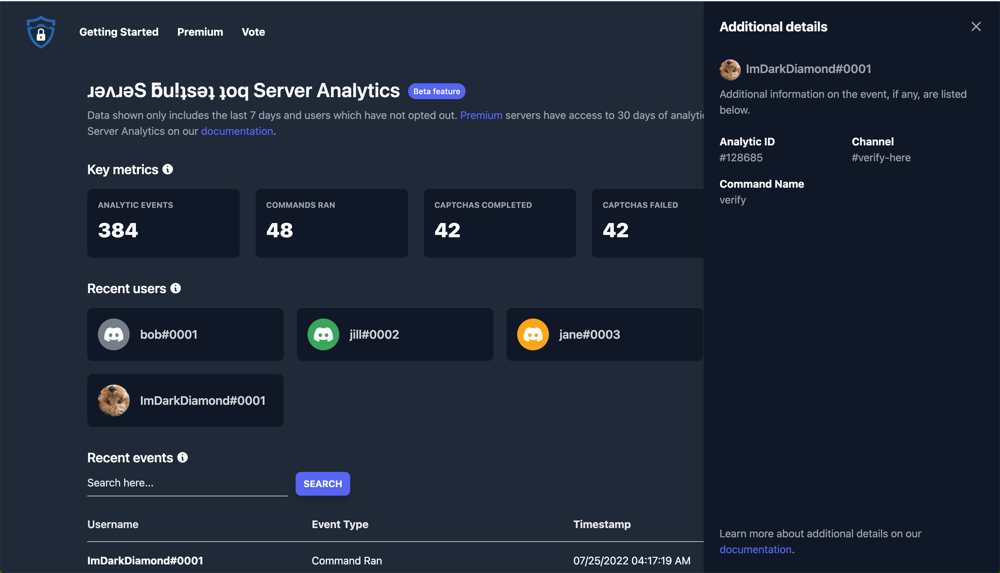

# Server Analytics

Server analytics provide insights into how users are interacting with Captcha.bot in your server. It's a great tool for providing help to users who are stuck verifying, having few logs in your server, or for comparing data week to week. 

## Who can view server analytics?

Currently only server administrators and the server owner can view server analytics. In the future we will provide the option to let certain roles access analytics. You can get a link to your servers analytics by visiting our dashboard or running the `/analytics` command.

## Analytic Types

Captcha.bot provides analytics on quite a few events and interactions with the bot. These include are but not limited to:
- Captcha
    - Sent
    - Invalidated
    - Attempt submitted
    - Attempt failed
    - Completed
- User
    - Joined the server
    - Left the server
- Time limit reached
- "Why" button clicked on button panel

## Viewing more details

Some events which the bot tracks will contain additional data for you to view. Including but not limited to:

- Captcha attempt failed
- Captcha sent
- Captcha invalidated
- Command ran

To view any additional details on an analytic event you can click the row or the "View details" button. This will bring up a menu where you can view more specific data. To exit just click the X on the top right. 

## Searching

Since Server Analytics are in beta the search feature is quite limited. You can search by user id: `user:123456789` or by username: `username:imdark`

## Exporting

You can export your server's analytics ever hour. Please be patient as it can take a few seconds or minutes to gather all your data and convert it to a CSV for download. 

## Opting out of server analytics/Our security practicies

We use industry standard encryption & security practicies on our servers and data. Data is only stored for up to 30 days (for most servers: 7 days).

As a user you can opt out being shown in server analytics by emailing `contact@privy.gg`. [View our privacy policy](https://privy.gg/legal).