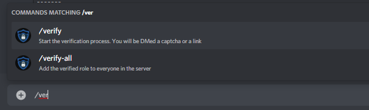
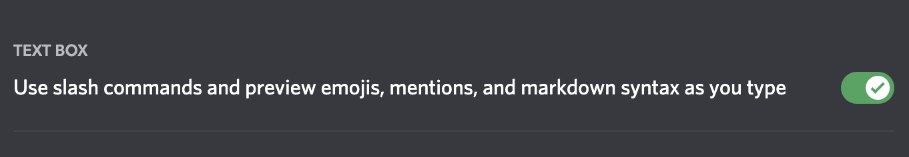

# Commands

- `/verify`

This is a command that only users without the verification role can use. Captcha.bot will prompt them with a captcha (either link or image).

- `/reset`

This command resets the users pending captchas in all servers.

- `/config`

Get the link to the server's dashboard so you can view and configure the bots various settings.

- `/analytics`

Get a link to your server's [analytics](../logging/server-analytics.md) page

# What are slash commands?

Slash commands are used by typing slash (/) and selecting a command. Most if not all bots are using slash commands. You can learn more about them [here](https://blog.discord.com/slash-commands-are-here-8db0a385d9e6) and [here](https://support.discord.com/hc/en-us/articles/1500000368501-Slash-Commands-FAQ).

## Who can run slash commands?

Everyone in your server who has the `Use Application Commands` permission can run slash commands. Captcha.bot is setup with some default permissions on commands which resricts some commands to administrators. You can change who has access to each command in your Discord server's settings -> Integrations -> Captcha.bot.

## Common issues

### Slash commands don't show up when I type /

There are a few reasons why slash commands won't show up for you or other users in your server. 

#### Server Administrators and owners:

- Re-invite the bot and make sure it has slash command permissions. You can invite it [here](https://captcha.bot/invite)
- Verify that the @everyone role has the `Use Application Commands` permission. They should have this permission on the @everyone role and on the channel level. 
 
If slash commands still aren't showing please continue to the Users section below:

#### Users:

- Update your Discord app. If you're on an Android device yyou should especially do this. Or buy an [iPhone](https://apple.com).
- Enable the following setting under "text and images" in your discord account settings:

### I get "Interaction failed" when running slash commands

Interactions may fail when the bot is having issues or your app is out of date. Please wait 10 minutes to an hour and the problem should be resolved if Captcha.bot is having an outage. 