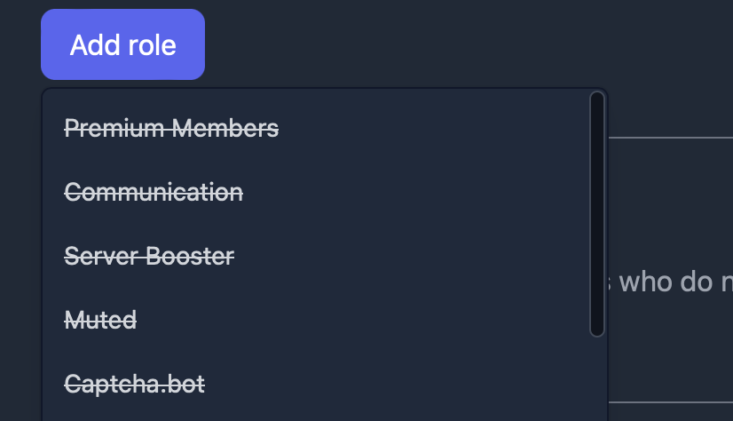
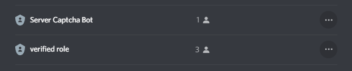

# Frequently Asked Questions

Here are some common questions we receive. Please read them all before asking for help in our server. 

## What kinds of servers can use Captcha.bot?

All communities are welcome to use Captcha.bot as long as they follow Discord's terms of service. Captcha.bot's goal is to make every server on Discord more secure and safe. 

Please note that if you are a **large sever** you may be subject to **automatic** and **temporary** (up to 24 hours) **blacklisting** if your server causes extreme load (e.g. hundreds of users trying to verify a second or heavy spam in a short period) on the bot. If you suspect you've been blacklisted then please reach out in our support server so we can work with you and discuss options. 

## How do I setup the bot?

A tutorial can be found [here](../introduction/setup-process.md).

## My server does not appear on the dashboard

If you cannot access your server's dashboard then you need to send a message in the server (in a channel the bot can read messages.) You may also need to logout and login to the dashboard again so we can refetch your server list. 

## I get "Invalid form body" or another error when clicking buttons or running commands

You're probably using Discord on Android. Update your app or buy an [iPhone](https://apple.com).

## How do I setup a panel or button

A tutorial can be found [here](../specific-features/button-panels.md).

## I can't select a role or channel on the dashboard because they're striked out

### Channels

Make sure that the bot has the following permissions:

- Send messages
- View channel
- Embed links

### Roles: 

Make sure that the bot has the `Manage Roles` permission and that the Captcha.bot role is **ABOVE** the role's you want it to manage. 

## Captcha.bot isn't assigning roles

Make sure that the bot has the `Manage Roles` permission and that the Captcha.bot role is **ABOVE** the role's you want it to manage. 

## Does the bot block alt accounts or look for VPNS?

Captcha.bot does look for VPNs and proxies, if enabled. Captcha.bot is not made to detect alt accounts, instead focusing on preventing mass raids and spam.
