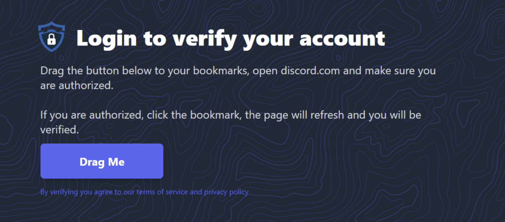
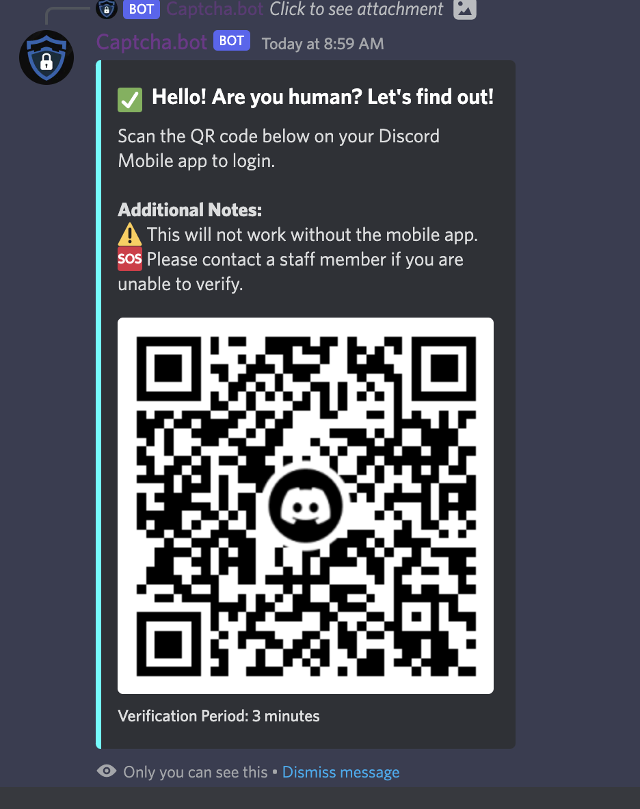
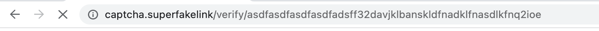
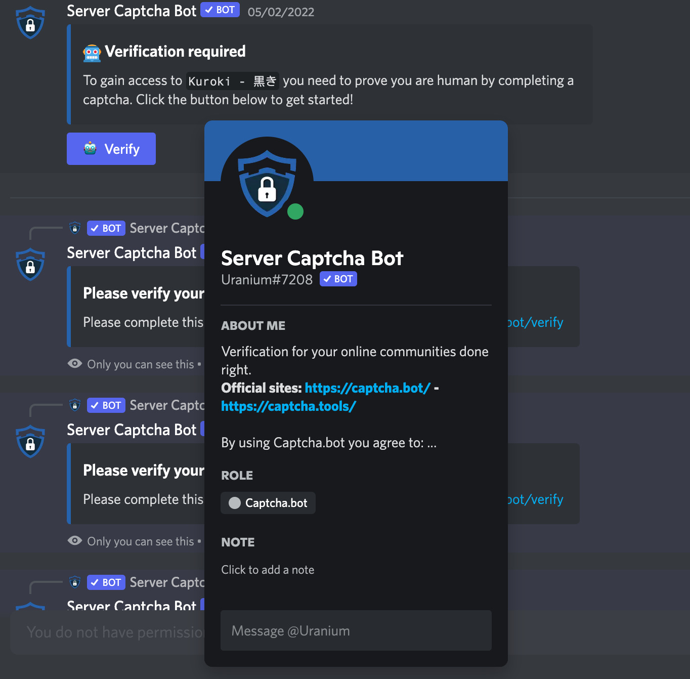

# Phishing Scams

Unfortunately malicious server owners and developers commonly attempt to impersonate Captcha.bot due to its size and popularity. On this page we have listed the known common scams, how to avoid them, and how to report them to Discord.

Remember to always be diligent when online. 

### Not sure if you're being scammed?

Look through this page or ask in our [support server](https://discord.gg/captcha). It's okay to not be sure! You can always ask in our support server and we'll let you know if you're interacting with the real bot. 

## The Scams

### Drag button

Captcha.bot does **NOT** ask you to drag a button to your bookmarks.

::: danger
Bots and websites which ask you to drag a button into your bookmarks are attempting to steal your Discord account. Do **NOT** drag the button and click it. It will run malicious code and steal your Discord account credentials. 
:::

### QR Codes

Captcha.bot does **NOT** use QR codes to verify you are a human. We do not ask for QR codes in the Discord app or on our website. **Discord.com** may prompt you a QR code when you login, but NOT Captcha.bot.

::: danger
Bots or websites which ask you to scan a QR code with your mobile app are attempting to steal your Discord account. Do **NOT** scan the QR code.
:::

### Domains 

Captcha.bot will only ever ask you to verify at https://captcha.bot. Please make sure you always check the domain and verify it is https://captcha.bot. If it is not, then do not verify and leave the page. 

::: danger
Bots which ask you to verify on a website which is not https://captcha.bot are attempting to scam you. Do **NOT** verify or visit these fake sites. 
:::

### Crypto/NFTS

Captcha.bot will **NEVER** ask you for a Crypto wallet or NFT login (EG: Metamask). Captcha.bot only asks you to login with Discord, which only gives us access to read your username, avatar, and servers you are in. 

::: danger
Bots which ask you to verify your Crypto wallet or NFT login are attempting to steal your Crypto or NFTs. Do **NOT** "verify" or "connect" your account.
:::

### Username/nickname scams

Server owners may rename another bot by changing the nickname or name and avatar to appear as Captcha.bot. Always check that you are only using and interacting with `Captcha.bot#3928` (ID: 512333785338216465) Please note that our bot is also verified by Discord but be aware that Discord has verified some of the scam bots in the past. 

::: danger
Bots which different nicknames & avatars are attempting to scam you. Do **NOT** verify with them.
:::

## Reporting scams

Unfortunately, there is very little which Captcha.bot can do to prevent these scams or take them down. You will need to reach out to Discord support, not Captcha.bot support. 

### Reporting bots

You can report fake bots to Discord's support team [here](https://dis.gd/report)

### Reporting domains

You can report fake domains to Google's [safebrowsing](https://safebrowsing.google.com/safebrowsing/report_phish/?hl=en)