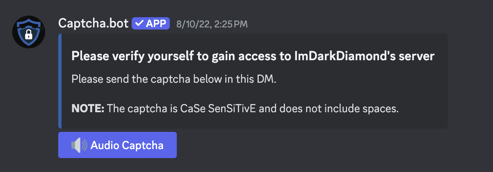
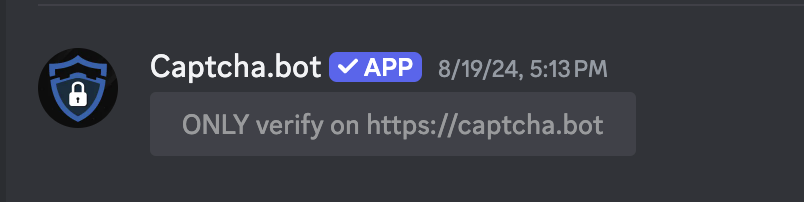

# Common Verification Problems

Having trouble verifying in a server? On this page we'll cover our most commonly asked questions related to verification

## I completed verification but didn't get access or a role

The server has permission problems. We are unable to do anything about this. Server administrators will need to make sure Captcha.bot can [manage roles](./faq.md#captcha-bot-isn-t-assigning-roles).

## I can't view images

Enable images by going to Discord user settings -> Chat -> Display Images, VIDEOS, and LOLCATS -> When posted as links to chat -> Toggle it on.

## I can't view embeds

Enable embeds by going to Discord user settings -> Chat -> Embeds and Link Previews -> Show embeds and preview website links pasted into chat -> Toggle it on.
