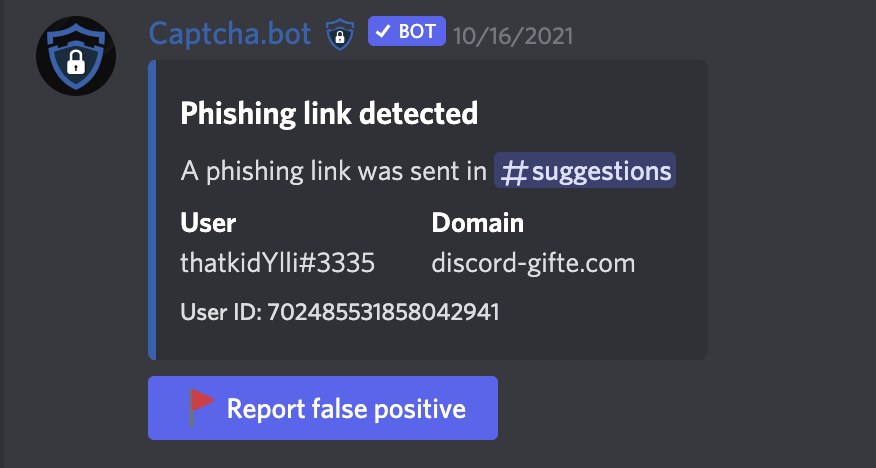
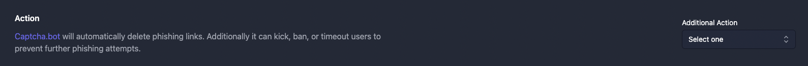
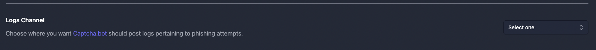

# Anti-Phishing

Captcha.bot can monitor for and delete messages in your server which contain phishing links. This will prevent users in your server from being hacked & have their account stolen. 

Anti-phishing is enabled by default in all servers the bot has the `Manage Messages` permission.

### What links may be flagged and deleted?

- NSFW Discord invites
- Steam phishing links
- Discord account phishing links
- Certain URL shorteners
- Other phishing links

## Additional Actions

Optionally you can configure Captcha.bot to apply an additional action to the user if deleting the message isn't sufficient enough. Captcha.bot provides three additional options:

- Timeout (for a period of time)
- Kick
- Ban

You can setup an additional action on the dashboard.

## Phishing Logs

Don't trust Captcha.bot's judgement or just want a log? Configure a logs channel on the dashboard and Captcha.bot will send a log every time it takes action on a message and user. 

