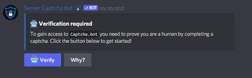
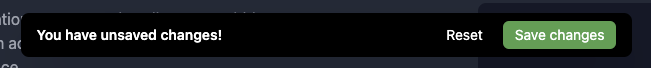
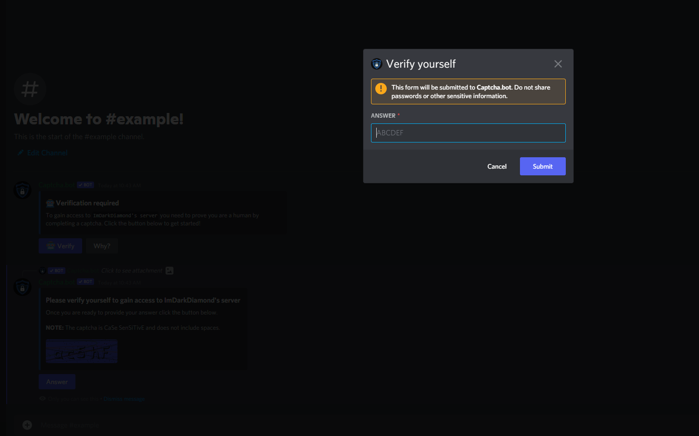

# Button Panels

Button panels are an embed sent in your server where users click a button to get verified. This makes it so users can verify in your server rather than have to go to their direct messages. Normally this is sent in your rules channel so users can quickly and easily find it to begin verification. 

### Why you may want to use a button panel

- Professional and clean
- No verification channel for users to spam messages and commands in
- Users do not need to open their direct messages
- Users do not need to run any commands to verify

## Button panel setup

We assume you have already ran through the [setup process](../introduction/setup-process.md). 

Firstly, you will need to change the verification location to "Button panel." The button panel will be posted to your your chosen verification channel. Feel free to customize the message before having the bot post the message. If you have an existing panel, the dashboard will provide you a link to it. 

You can configure:
- Embed title
- Embed color
- Embed description

::: info
You can only use the standard Discord emojis for the button
:::

Don't forget to save your changes!

## FAQ

### How does the button panel work with image verification?

#### Image Panel Quirks

Right now the image panel has a lot of quirks that the web panel does not have. If you want users to have an easy and flawless experience then we recommend you hold off on using the image panel for now and use web verification. 

- Users cannot yet request an audio captcha. This is on our todo list but we do not have an ETA
- Discord's new forms are not rolled out on all devices (mainly android)