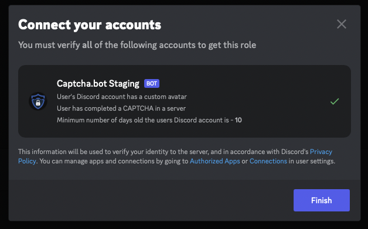

# Linked Roles

Link your Captcha.bot account to Discord

::: info
This is **NOT** a replacement for our [advanced verification](../introduction/setup-process.md), This can be a good utility for small discord servers with small verification requirements.
:::

Captcha.bot has partnered with Discord with their new [Linked Roles](https://discord.com/blog/connected-accounts-functionality-boost-linked-roles) feature!

## Configuration

You can require users to connect with Captcha.bot. Additionally, you can require that they have passed a CAPTCHA, have a certain account age, and/or a custom avatar. 

## Profile Metadata

When you link your Captcha.bot account to Discord you will be able to see some of the data on your profile!

